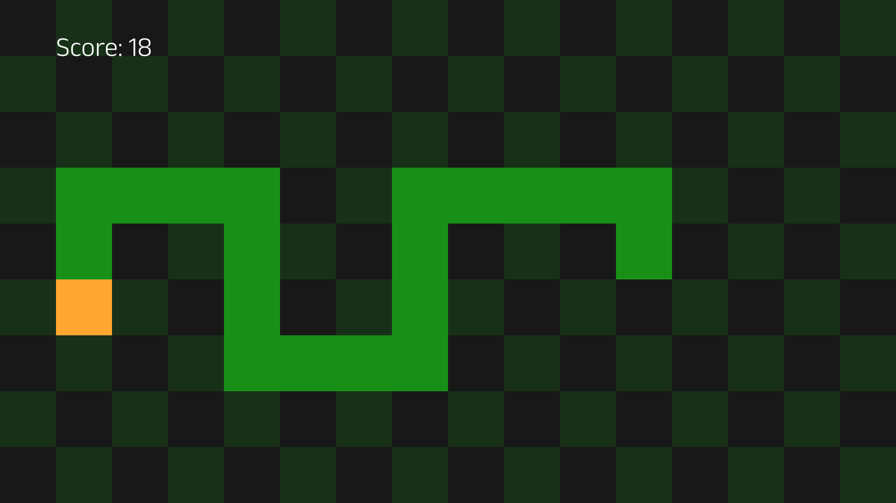

# Snake

[](http://tsoding.org/snake-c-wasm/)

## Quick Start

### Build

```console
$ ./build.sh
```

### Running SDL version

```console
$ ./sdl_main
```

### Running WASM version

```console
$ python -m http.server 6969
$ iexplore.exe http://localhost:6969/
```

### Running WASM4 version

```console
$ make
$ w4 run build/cart.wasm
```

## Font

[Anek Latin Light](https://github.com/EkType/Anek)
